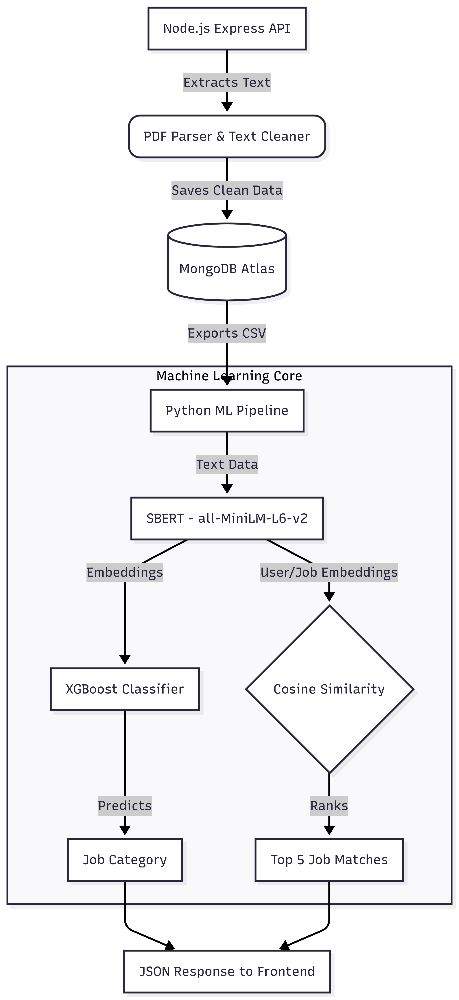

### ✨ Backend README (`Job_Recommendation_ML_backend`)

# ⚙️ ML-Powered Job Recommendation System (Backend & ML Pipeline)

> **Repository Links:**
> * ⚙️ **Backend Repository:** [Current Repo](https://github.com/dileeshan-kosa/Job_Recommendation_ML_backend.git)
> * 🖥️ **Frontend Repository:** [View Frontend Repo](https://github.com/dileeshan-kosa/Job_Recommendation_ML_frontend.git)

## 📖 1. Project Overview
This repository contains the backend infrastructure and Machine Learning pipeline for the Job Recommendation System. Built on Node.js and Express, the server handles secure user authentication, MongoDB data management, and PDF parsing. Crucially, it orchestrates a Python-based NLP and ML pipeline that uses SBERT (Sentence-BERT) for semantic embeddings and XGBoost for job category classification and similarity scoring.

## ✨ 2. Key Features
* **Robust API Gateway:** Express-based REST API handling user sessions, job postings, and CV uploads.
* **Automated Data Processing:** Parses uploaded PDFs (`pdf-parse`), cleans text, and removes stopwords dynamically.
* **Semantic Embeddings:** Uses the `all-MiniLM-L6-v2` Sentence Transformer model to convert resumes and job descriptions into high-dimensional vector spaces.
* **XGBoost Classification:** Predicts overarching job categories based on embedded user data.
* **Cosine Similarity Matching:** Calculates proximity between user embeddings and job embeddings to recommend the top 5 best-fitting roles.

## 🗺️ 3. System Architecture & Data Flow
 
 

## 🛠️ 4. Tech Stack

**Backend / Server:**

* **Runtime:** Node.js
* **Framework:** Express.js
* **Database:** MongoDB & Mongoose
* **Authentication:** JWT, bcryptjs
* **Utilities:** Multer (file uploads), PDF-Parse, Stopword

**Machine Learning / Python:**

* **NLP:** Sentence-Transformers (SBERT)
* **Modeling:** XGBoost, Scikit-learn
* **Data Manipulation:** Pandas, NumPy

## 📂 5. Project Structure

```text
Job_Recommendation_ML_backend/
├── exports/                  # Generated CSVs and .npy embedding files
├── models/                   # Mongoose schemas & saved XGBoost model (.json/.pkl)
├── python/                   # ML Pipeline Scripts
│   ├── generate_embeddings.py
│   ├── xgboost_pipeline.py
│   └── viewResultbyModel.py
├── routes/                   # API route definitions
├── controllers/              # API logic (e.g., manageUserProfileDetails.js)
├── index.js                  # Express server entry point
└── package.json              # Node dependencies

```

## 💻 6. Local Setup & Installation

**Prerequisites:**

* Node.js (v16+)
* Python (v3.8+)
* MongoDB Atlas cluster or local MongoDB instance

**1. Clone the repository**

```bash
git clone [https://github.com/dileeshan-kosa/Job_Recommendation_ML_backend.git](https://github.com/dileeshan-kosa/Job_Recommendation_ML_backend.git)
cd Job_Recommendation_ML_backend

```

**2. Install Node.js Dependencies**

```bash
npm install

```

**3. Install Python Dependencies**
Ensure your Python environment is active, then install the required ML libraries:

```bash
pip install pandas numpy sentence-transformers xgboost scikit-learn

```

**4. Configure Environment Variables**
Create a `.env` file in the root directory:

```env
PORT=8000
MONGODB_URI=your_mongodb_connection_string
JWT_SECRET=your_secret_key

```

**5. Start the Server**

```bash
npm run dev

```

The server will start on `http://localhost:8000`.

## 🚀 7. Future Enhancements

* Abstract the ML training pipeline (`xgboost_pipeline.py`) into a scheduled background cron job to reduce API latency.
* Implement Docker containers (Docker Compose) to easily spin up the Node and Python environments together.
* Add caching (e.g., Redis) for frequently requested job predictions to save computational resources.


## 🧑‍💻 Author

* [Dileeshan Kosala](https://github.com/dileeshan-kosa)

---
---